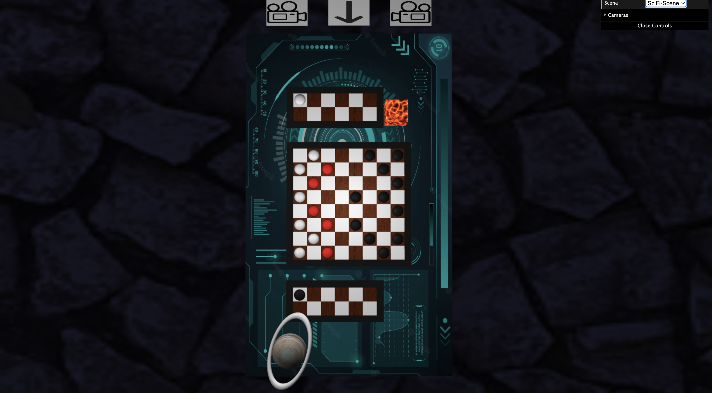
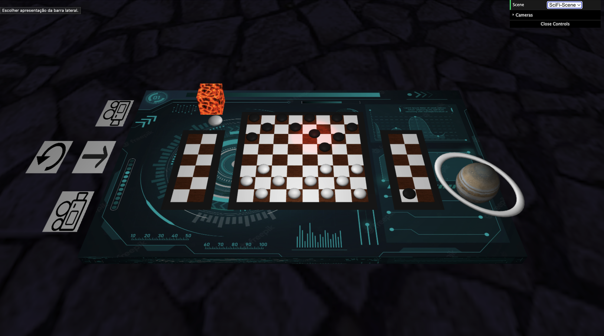

# 3D checkers game

Developed by:

| Name        | E-Mail               |
| ----------- | -------------------- |
| Diogo Maia  | up201904974@fe.up.pt |
| Luis Viegas | up201904979@fe.up.pt |

---

## Project

A 3d version of the checkers game made as part of the Masters in Software Engineering.
The game was developed using webGL and the [WebCGF](https://paginas.fe.up.pt/~ruirodrig/pub/sw/webcgf/docs/) framework and using the but everything else was made from scratch.

# Screenshots

### How to run?

Start a live server on the root folder and navigate to the "game" folder

## User Instructions

### Selecting scene

The user can use the Web GUI to select between two scenes: ‘Sci-Fi Scene’ and ‘Park Scene’. This changes the scenarios and is possible to do before or at any stage of the game.

### Changing Camera

There will be three buttons on one side of the table. The user can select the button in the middle to watch the middle view and select one of the others to have either the black or the white checkers view.

### Play the Game

To play the game, the user must press the ‘S’ or ‘s’ keyword for it to start. As the rules state, the black checkers start and there will be some checkers with a red color. These are the checkers the player is able to play.
The user may click on a checker that is red and after that click, some tiles will glow. Those are the available plays that the user can do and click on those tiles will execute a move. Beware, if there is a possibility for the user to eat a checker, he is obligated to eat.
If the user selected a piece but wants to change it, he can select another highlighted piece. The currently selected piece will have a slightly different color and a spotlight highlighting it.
If the player decides to undo a move, he must do it at piece selection stage. To undo a move, he/she must click on the button on the side of the middle camera button. This will undo one move. To keep undoing, click again after the animation is over.
When the game is over, there will be a pop-up saying who was the winner and the game will be reset to the initial stage, the one before pressing the start button.

