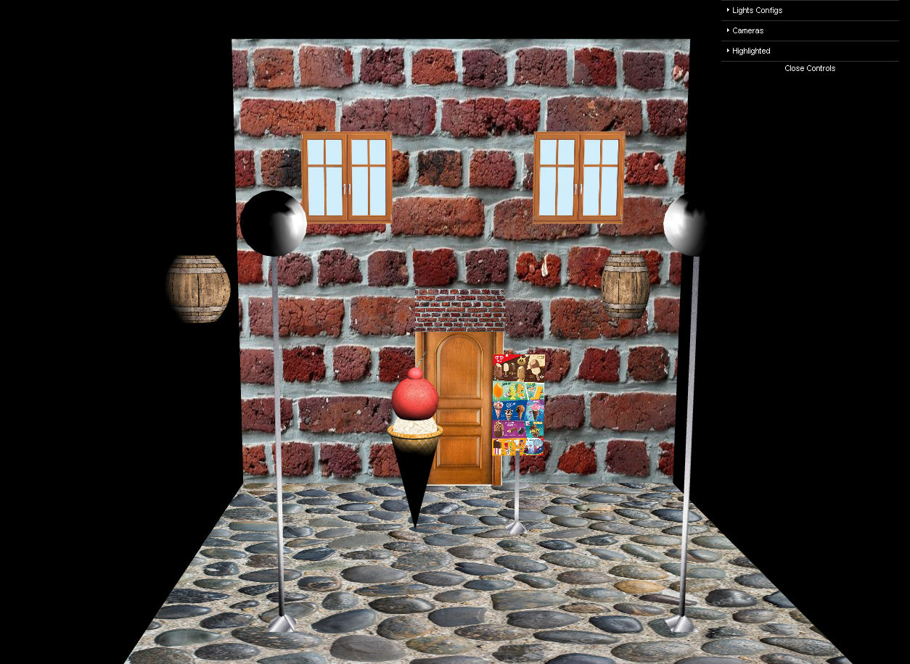

# SGI 2022/2023 - TP2

## Group: T06G10

| Name             | Number    | E-Mail             |
| ---------------- | --------- | ------------------ |
| Diogo Maia       | 201904974 | 201904974@fe.up.pt                |
| Luis Viegas         | 201904979 | 201904979@fe.up.pt                |

----
## Project information

- NURBS: Non-uniform rational B-splines
 We implemented the 3 asked objects with NURBS:
    - A rectangle
    
    - A tent
    
    - A barrel
    

- Shaders: A shader that implements a pulsating effect on an object
    - A pulsating effect on a sphere and the color changes to red
    - 1st screenshot: The sphere is not pulsating
    - 2nd screenshot: The sphere is pulsating
    
    

- Animation: A scene with an animated object
    - A scene with a rotating barrel where on the right a barrel is rotating during 100 seconds  
    
- Scene
  - Our scene is a ice cream store with 2 lamps, a big ice cream cone with two balls and a cherry on top. 
  - We changed from the previous iteration all the rectangles to NURBS; 
  - We added two barrels who fall at the same time, one is rotating while falling but both do the same animation;
  - We added a tent as a door top;
  - We added a pulsating effect on the ice cream ball, cherry stick and tent;

  
----
## Issues/Problems

- None we discovered
